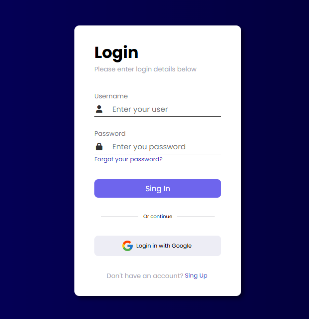

# Login Page Project

This project is a responsive **Login Page** designed using HTML, CSS, and JavaScript. It includes a modern design with styled input fields, buttons, and dynamic background colors that change based on the time of day.

## Features

- **Dynamic Background Color**: 
  - Morning (6:00 AM - 12:00 PM): Blue gradient (`--color-gradient`);
  - Afternoon (12:00 PM - 6:00 PM): Orange gradient (`--color-gradient-orange`);
  - Evening/Night (6:00 PM - 6:00 AM): Dark blue gradient (`--color-gradient-dark-blue`);
  
- **Login Form**:
  - Input fields for username and password with icons;
  - "Forgot your password?" link;
  - Sign-in button;

- **Social Media Login Option**:
  - Login with Google button;

- **Account Registration**:
  - A link to the registration page for users without an account;

- **Responsive Design**:
  - Uses modern CSS for flexibility and responsiveness;

## Preview



## How to Run the Project

If you use vscode you can simply open it using live server. If you want to adventure with somenthing hardcore, you can do the following:

1. **Download or Clone the Repository**:
   ```bash
   $ git clone https://github.com/your-username/login-page.git
   ```
2. **Access the project directory:**
   ```bash
   $ cd login-page
   ```

3. **Start a local HTTP server with Python 3:**
   ```bash
   $ python3 -m http.server
   ```
   This will start a server on port 8000. You should see something like:
    ```bash
    Serving HTTP on 0.0.0.0 port 8000 (http://0.0.0.0:8000/) ...
    ```
4. **Open your browser and go to `http://localhost:8000`**

5. **Click on the `index.html` file or navigate directly to `http://localhost:8000/index.html`**

